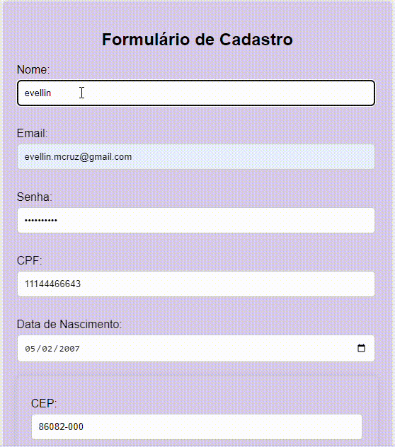

# form-cadCompleto 🚀 

## Índice 🌠

* [Descrição](#descrição)                            
* [Funcionalidades](#funcionalidades)
* [Tecnologias Utilizadas](#tecnologias-utilizadas)
* [Principais Funções](#principais-funções)
* [Referência](#referência)
* [GIF](#GIF)
* [Projetos usados de suporte](#Projetos-usados-de-suporte)

## Descrição 🪐 

Este projeto é um inovador formulário de cadastro que aproveita o CEP (Código de Endereçamento Postal) para preencher automaticamente os dados de endereço do usuário. Com apenas a inserção do CEP, os campos de endereço, cidade e estado são preenchidos de forma instantânea, proporcionando uma experiência fluida e ágil. Essa funcionalidade não apenas economiza tempo, mas também torna o processo de cadastro muito mais prático e eficiente para todos os usuários.

## Funcionalidades ⭐

> Campo de CEP: O usuário insere o CEP e, ao perder o foco ou pressionar Enter, os dados de endereço são preenchidos automaticamente.

> Autocompletar: Utiliza uma API para buscar informações de endereço com base no CEP fornecido.
Validação: Verifica se o CEP é válido antes de realizar a busca.

## Tecnologias Utilizadas ☄️

* HTML5
* CSS3
* JavaScript
* API de Consulta de CEP (ViaCep)

## Principais Funções 🛸

* fetch
* await
* async
* focusout

## Referência 🌌

> fetch: fornece uma interface JavaScript para acessar e manipular partes do pipeline HTTP, como pedidos e respostas. MDN Fetch API

> HTTP Pipelines: técnica que permite o envio de múltiplas requisições HTTP em uma única conexão. LBODEV

> await: faz a execução de uma função async pausar, aguardando o retorno da Promise, e retoma a execução da função async quando o valor da Promise é resolvido. MDN Await

> async: declaração que cria uma função assíncrona, permitindo que o comportamento assíncrono e baseado em promessas seja escrito de forma mais limpa. MDN Async

> JSON: objeto namespace que contém métodos estáticos para analisar valores e convertê-los em JavaScript. MDN JSON

> focusout: evento que é disparado quando um elemento perde o foco, após o evento blur. MDN focusout

> blur: evento que é disparado quando um elemento perde o foco. MDN blur

## GIF 🌕

## Projetos usados de suporte ✨

* [form-Cadendereco](https://github.com/Evellincruz/form-Cadendereco)
* [Login-Cad](https://github.com/Evellincruz/login-cad)

Peguei algumas referências desses projetos, para realizar essa proposta dada pelo professor Leonardo.

Link do ViaCep:  https://viacep.com.br/
